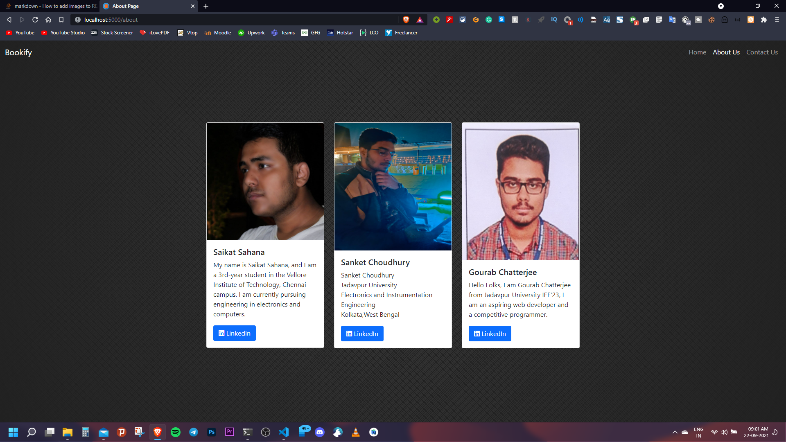
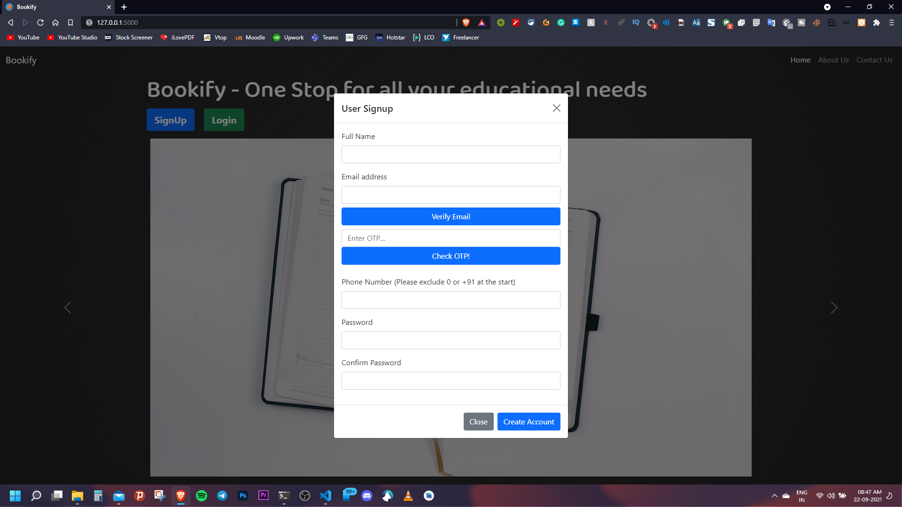
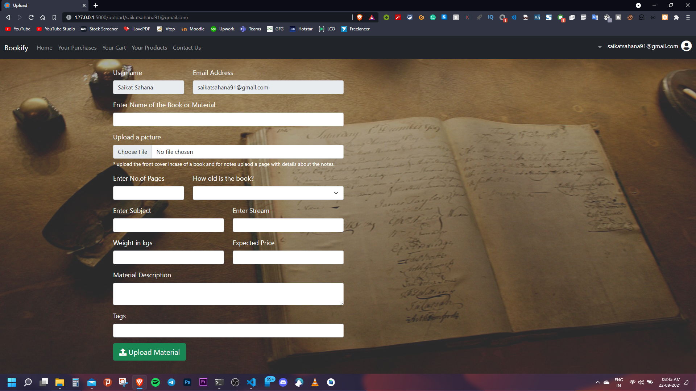
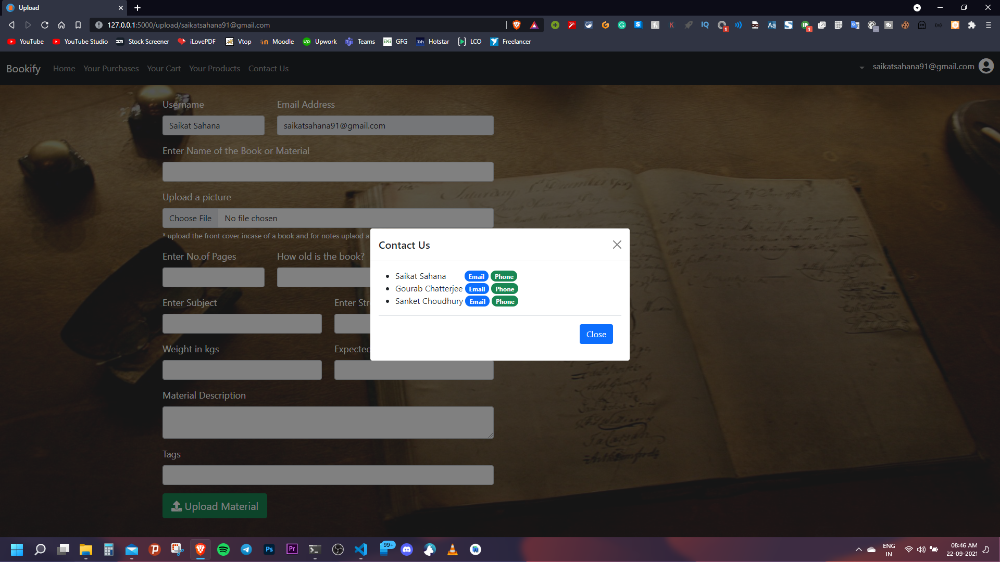

# Bookify - A Student Platform!

## INSTALLING THE BELOW MENTIONED PACKAGES AND RUNNING IT ON LOCALHOST IS RECOMMENDED 
### (DUE TO INTERNAL ERRORS IN THE PAYMENT GATEWAY API IN THE LIVE SERVER WHICH IS BEYOND OUR SCOPE OF DEVELOPMENT) (FOR OTHER FUNCTIONALITIES EXCEPT THE PAYMENT GATEWAY THE LIVE WEBSITE CAN BE ACCESSED AT https://bookify.pythonanywhere.com/ )
<br>

>One Stop for all your educational needs

## LocalHost Usage Instructions :

- Download the contents of The Repository as a Zip File or clone the Repository.
- Install Python in your Machine. Instructions are avialable here. https://realpython.com/installing-python/
- Install the python packages mentioned inside the requirments.txt file by the following command in your terminal:
    ```python3
    >>> pip install -r requirements.txt #for windows
    >>> pip3 install -r requirements.txt #for macos and linux
    ``` 
- Run the server.py file by running <i>python server.py (for windows)</i> or <i>python3 server.py (for linux and macos)</i> on it.
- Then a local server is expected to spin up in your system if all the steps are followed correctly. Now go to the address:  http://127.0.0.1:5000/ to check our web app. 
- Then follow the video mentioned below to have a walthrough of the whole web app.

## Technologies used:
- Fronetend: HTML, CSS, JS and few libraries like Bootstrap to facilitate creating the UI, Font Awesome to use vector Graphics and also Jquery to handle AJAX Calls, some dependencies like popper.js is included to assist Bootstrap but not used directly.

    

- Backend: Backend consists of Python programming Language and the main module that powers the server is flask which is a microframework written in Python to create web servers easily and quickly. Also the second important module used in sqlite that handles the sqlite database opeartions. Also apart from flask,sqlite and their helper methods, we are also using email, smtplib and ssl modules for sending password reset and email confirmation emails, opencv, numpy and pillow modules for processing images of uploaded books/ materials, instamojo_wrapper for handling the instamojo payment gateway integrated in our website. Also other core python modules like os (to set path of images uploaded) and random and math modules (to create a random otp and random file names) are used.

    <p align="center">
        
        <br>
        
    </p>


## Overview:
- Home Page

- About Us Page

- SignUp Modal

- Login Modal

- Profile Page

- Post Creation Page

- Contact Us Modal



## Authors Info :

- Youtube - [Tech Rack (Saikat Sahana)](https://www.youtube.com/TechRack)
- Twitter - [@sahana_saikat](https://twitter.com/sahana_saikat)
- Website - [Tech Rack (Saikat Sahana)](https://tech-rack.in)
- Facebook - [Saikat Sahana](https://www.facebook.com/saikat.sahana.75), [Sanket Choudhury](https://www.facebook.com/sanket.choudhury.92/), [Gourab Chatterjee](https://www.facebook.com/profile.php?id=100008842748927)
- Instagram - [saikat2811](https://www.instagram.com/saikat2811/), [choudhurysanket](https://www.instagram.com/choudhurysanket/)
- LinkedIn - [Saikat Sahana](https://www.linkedin.com/in/saikat-sahana-454608118), [Sanket Choudhury](https://www.linkedin.com/in/sanket-choudhury-522772201/), [Gourab Chatterjee](https://www.linkedin.com/in/gourab-chatterjee-a902221a4)
- Github - [saikatsahana77](https://github.com/saikatsahana77), [GouraV-Chatterjee](https://github.com/GouraV-Chatterjee), [SanketChoudhury](https://github.com/SanketChoudhury)
